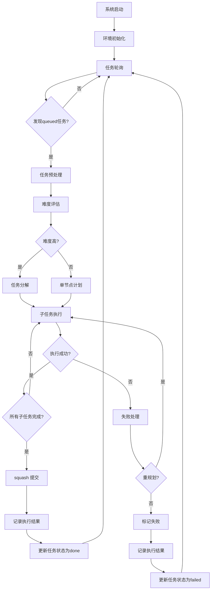

# Agent Bridge 运行流程链路详解

本文档面向开发者，详细梳理了 Agent Bridge 项目从任务定义到完成状态更新的完整运行流程链路。

## 1. 系统初始化阶段

### 1.1 环境准备

系统启动时，`main.js` 作为入口文件，调用 `main_index.js` 中的 `main()` 函数，执行以下操作：

1. **加载环境变量**：读取 `.env` 文件，设置环境变量
2. **初始化环境**：调用 `initEnvironment()` 函数，完成以下工作：
   - 加载配置文件 `config.json`，如果不存在则创建默认配置
   - 创建必要的目录结构：
     - `tasks/` 目录及其子目录 `raw/`
     - `bridge/` 目录
     - `workspace/` 目录
   - 检查并创建 `task.json` 文件，初始状态为 `idle`
   - 检查并创建 `bridge/memory.json` 文件，用于记录任务执行历史
   - 初始化 Git 仓库（如果不存在）
   - 记录初始化日志

### 1.2 任务轮询

环境初始化完成后，系统进入任务轮询阶段，由 `polling.js` 中的 `pollLoop()` 函数实现：

1. **定期检查任务状态**：默认每 1000ms 检查一次 `task.json` 文件
2. **识别待执行任务**：当任务状态为 `queued` 且包含有效的 `task_id` 和 `instruction` 时，触发任务执行
3. **执行工作流**：调用 `executeWorkflow()` 函数处理任务
4. **循环执行**：除非指定 `--once` 参数，否则会持续轮询

## 2. 任务执行阶段

### 2.1 任务预处理

任务开始执行时，`workflow.js` 中的 `orchestrateLongTask()` 函数首先进行预处理：

1. **检查重复执行**：检查任务是否已经处理过，避免重复执行
2. **标记任务状态**：将任务状态更新为 `running`，记录开始时间
3. **记录初始状态**：获取当前 Git 仓库的 HEAD SHA，作为任务的基准状态
4. **初始化执行上下文**：创建错误记录、反馈历史、执行跟踪等数据结构

### 2.2 难度评估

系统会评估任务的难度和复杂度：

1. **提取可能的文件路径**：从任务指令中提取可能需要修改的文件路径
2. **计算文件复杂度**：统计相关文件的总行数
3. **评估任务难度**：根据指令复杂度、文件数量和代码量评估任务难度（低、中、高）

### 2.3 任务分解

根据任务难度，系统会采取不同的处理策略：

1. **高难度任务**：调用 `planner.decomposeTask()` 将任务分解为多个子任务，形成 DAG（有向无环图）
2. **中低难度任务**：构建单节点任务计划

### 2.4 子任务执行

对于每个子任务，系统执行以下流程：

#### 2.4.1 准备阶段

1. **创建检查点**：在执行子任务前，创建 Git 检查点，记录当前状态
2. **更新计划状态**：将子任务状态更新为 `running`
3. **记录开始时间**：记录子任务的开始时间

#### 2.4.2 代码生成

1. **确定操作类型**：分析子任务指令，确定需要执行的操作类型（内容编辑或文件操作）
2. **评估子任务难度**：评估子任务的难度级别
3. **选择模型**：根据难度级别选择合适的模型（Ollama、OpenAI 或 Claude）
4. **收集上下文**：收集工作区文件内容和 Git 状态作为模型输入
5. **优化上下文**：根据任务难度和模型能力优化上下文内容，控制 token 使用
6. **构建提示**：构建包含任务指令、上下文和反馈的提示
7. **生成代码**：调用模型生成代码和操作指令

#### 2.4.3 解析和验证

1. **解析响应**：解析模型输出，提取操作指令
2. **验证操作模式**：验证操作指令是否符合指定的模式
3. **验证变更集**：验证变更集的有效性和安全性
4. **自我纠正**：如果解析失败，尝试通过自我纠正机制修复

#### 2.4.4 应用变更

1. **安全应用补丁**：使用 Git 安全地应用变更
2. **处理应用失败**：如果应用失败，收集相关文件片段，生成反馈

#### 2.4.5 验证变更

1. **语法验证**：验证 JavaScript 和 JSON 文件的语法正确性
2. **语义验证**：对于中高难度任务，使用 Claude 进行深度语义审查

#### 2.4.6 提交检查点

1. **提交变更**：将成功应用的变更提交到 Git
2. **更新计划状态**：将子任务状态更新为 `done`，记录完成时间和提交 SHA
3. **记录执行轨迹**：记录子任务的执行情况，包括使用的模型、难度、执行时间等

### 2.5 失败处理

如果子任务执行失败，系统会：

1. **标记失败状态**：将子任务状态更新为 `failed`
2. **记录错误信息**：记录失败原因和错误详情
3. **回滚变更**：回滚到上一个稳定状态
4. **重新规划**：调用 `planner.replanFromFailure()` 重新规划剩余任务
5. **限制重规划次数**：如果重规划次数超过限制，将子任务标记为 `skipped`，允许其他独立子任务继续执行

### 2.6 任务完成

当所有子任务执行完成后，系统会：

1. ** squash 提交**：将所有子任务的提交合并为一个最终提交
2. **记录执行结果**：将执行结果写入 `tasks/result.json`，包括：
   - 任务执行状态
   - 变更情况
   - 提交信息
   - 执行轨迹
   - 错误信息（如果有）
3. **记录内存**：将任务执行信息记录到 `bridge/memory.json`，避免重复执行
4. **更新任务状态**：将任务状态更新为 `done` 或 `failed`
5. **记录日志**：记录任务执行完成的日志信息

## 3. 核心模块交互

### 3.1 模块职责

| 模块 | 主要职责 | 文件位置 |
|------|---------|----------|
| main | 主入口，协调整个流程 | src/core/main.js, src/core/main_index.js |
| polling | 任务轮询，检查任务状态 | src/core/polling.js |
| workflow | 任务执行工作流，协调各模块 | src/core/workflow.js |
| planner | 任务分解和规划 | src/core/planner.js |
| adapter | 模型适配器，与 LLM 交互 | src/core/adapter/ |
| verifier | 验证变更的正确性 | src/core/verifier.js |
| git_manager | Git 操作管理 | src/core/git_manager.js |
| fs_tools | 文件系统工具，处理文件操作 | src/utils/fs_tools.js |

### 3.2 模块交互流程

1. **main → polling**：启动任务轮询
2. **polling → workflow**：发现待执行任务时，调用执行工作流
3. **workflow → planner**：评估任务难度，分解任务
4. **workflow → adapter**：构建提示，生成代码
5. **workflow → git_manager**：创建检查点，应用变更，提交
6. **workflow → verifier**：验证变更的正确性
7. **workflow → fs_tools**：收集上下文，处理文件操作

## 4. 任务状态流转

任务在执行过程中会经历以下状态：

1. **idle**：初始状态，任务文件存在但未设置
2. **queued**：任务已定义，等待执行
3. **running**：任务正在执行中
4. **done**：任务执行成功
5. **failed**：任务执行失败
6. **skipped**：任务被跳过（通常是因为重复执行）

## 5. 执行流程图

## 6. 关键操作和技术亮点

### 6.1 智能任务分解

- **基于难度的分解**：高难度任务自动分解为可管理的子任务
- **DAG 依赖管理**：子任务之间的依赖关系通过有向无环图管理
- **失败重规划**：子任务失败时，自动重新规划剩余任务

### 6.2 多模型协同

- **模型选择**：根据任务难度和风险级别自动选择合适的模型
- **上下文优化**：根据模型能力和任务需求动态调整上下文内容
- **语义验证**：使用 Claude 进行深度语义审查，确保代码质量

### 6.3 安全保障

- **Git 集成**：完整的版本控制，支持检查点、提交和回滚
- **路径安全**：确保所有文件操作都在工作区范围内
- **变更验证**：多重验证机制确保代码变更的安全性和正确性

### 6.4 错误处理

- **详细的错误捕获**：捕获和记录执行过程中的所有错误
- **自我纠正**：在解析失败时尝试自我纠正
- **智能回滚**：在失败时自动回滚到上一个稳定状态

### 6.5 性能优化

- **上下文优化**：根据任务难度和模型能力优化上下文，减少 token 使用
- **并行处理**：支持并行工具执行，提高效率
- **缓存机制**：记录任务执行历史，避免重复处理

## 7. 配置和环境

### 7.1 配置文件

项目通过 `config.json` 文件进行配置，主要配置项包括：

- **路径配置**：工作区、任务和日志的路径
- **模型配置**：Ollama、OpenAI 和 Claude 的参数设置
- **路由策略**：基于难度和风险级别的模型选择阈值
- **上下文限制**：文件大小和数量限制
- **Git 配置**：默认分支和用户信息
- **轮询设置**：任务轮询的间隔和超时设置

### 7.2 环境变量

项目使用 `.env` 文件存储环境变量，如 API 密钥等敏感信息。

## 8. 使用方法

1. **配置环境**：编辑 `config.json` 文件，设置模型参数和路径；编辑 `.env` 文件，设置 API 密钥等环境变量
2. **创建任务**：在 `tasks/task.json` 文件中定义任务，设置任务 ID 和指令，将状态设置为 `queued`
3. **启动系统**：运行 `npm start` 启动任务轮询
4. **监控执行**：查看日志文件（bridge.log、claude.log、ollama.log）和 Git 提交记录
5. **查看结果**：检查 `tasks/result.json` 文件获取执行结果
6. **调试模式**：运行 `npm run debug` 启动调试模式，获得更详细的执行信息

## 9. 总结

Agent Bridge 是一个功能完整、架构清晰的代码自动化系统，通过集成多种 LLM 模型和开发工具，实现了从自然语言指令到代码执行的端到端流程。系统的核心优势在于：

- **智能任务管理**：根据难度自动分解任务，提高执行成功率
- **多模型协同**：根据任务需求选择合适的模型，优化资源利用
- **安全保障**：多重验证机制确保代码变更的安全性和正确性
- **Git 集成**：完整的版本控制支持，确保变更可追溯和可回滚
- **错误处理**：详细的错误捕获和反馈机制，提高系统的鲁棒性

通过本文档的梳理，开发者可以更清晰地了解 Agent Bridge 的运行流程，从而更好地使用和扩展该系统。